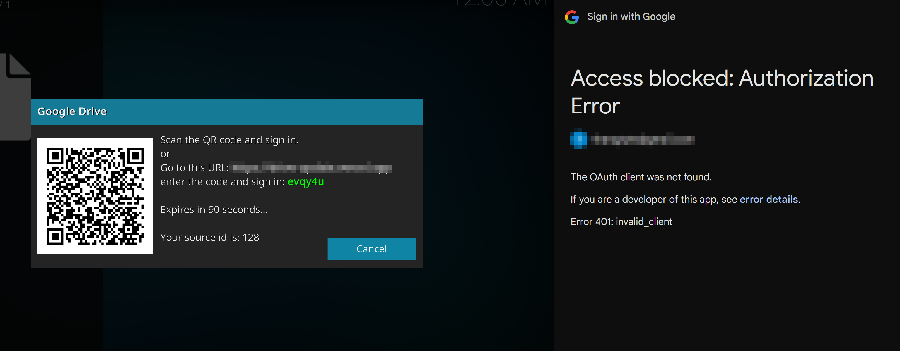

## Fix 0Auth client was not found?

- Lỗi này do bạn sử dụng mã nguồn mới nhất 2.0 (Phiên bản từ ngày 25/11/2024) từ tác giả [https://github.com/aldacco/drive-login]

- Bạn cần vào Vercel.com để thay đổi Enviroment Setting như file ``config.txt`` [click_here](https://github.com/thangnqs/kodi-gdrive/blob/master/config.txt)

- Thay đổi xong bạn ``Redeploy`` lại xác thực bình thường.

⚠️ GIÁ TRỊ `NEXT_PUBLIC_CLIENT_ID` THAY BẰNG ``GOOGLE_CLIENT_ID``

⚠️ GIÁ TRỊ `NEXT_PUBLIC_CLIENT_SECRET` THAY BẰNG ``GOOGLE_CLIENT_SECRET``

❌ KHÔNG CÒN SỬ DỤNG `NEXT_PUBLIC_REDIS_CONNECTION`
