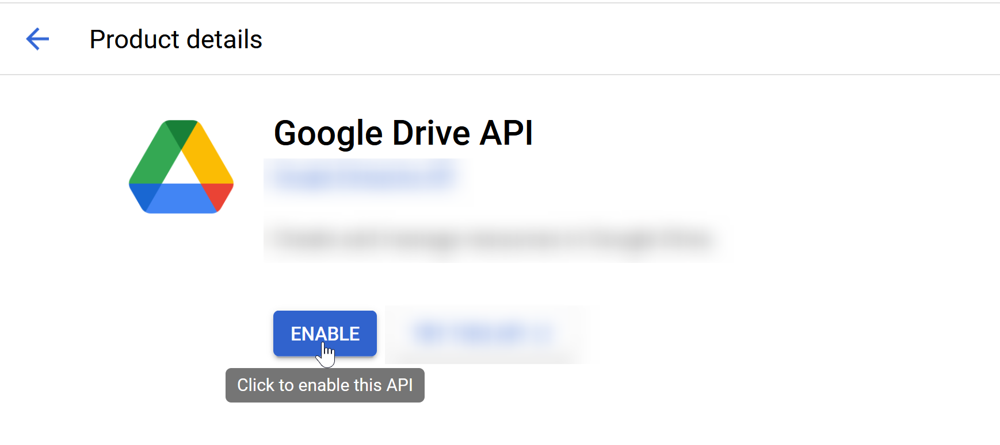
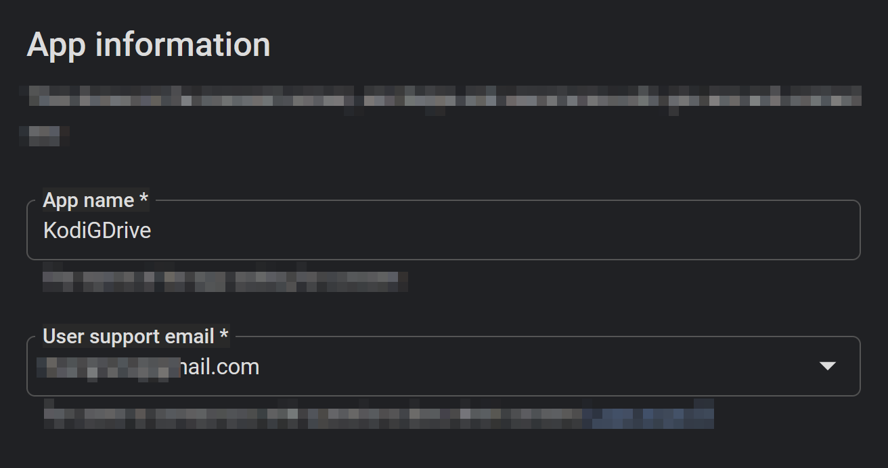
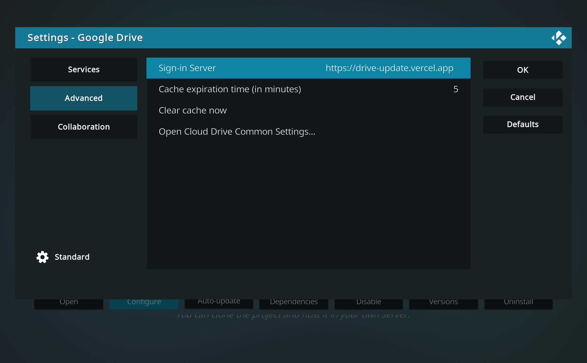

# 7 PHÚT SETUP KODI VÀ GOOGLE DRIVE

## Các bước chuẩn bị

- Tài khoản Github [https://github.com/signup]
- Tài khoản Vercel [https://vercel.com/]
- Tài khoản Google Drive [https://console.cloud.google.com]

#### Lưu ý: Nên dùng Github để login Vercel.com

## GOOGLE

### Truy cập trang [https://console.cloud.google.com/] và làm theo hướng dẫn như hình dưới


<br/>


<br/>


<br/>


<br/>


<br/>



<br/>


<br/>



<br/>


<br/>


<br/>


<br/>


<br/>


<br/>


<br/>


<br/>


<br/>

### Goto [https://vercel.com]

https://github.com/user-attachments/assets/e818be65-1b6b-48ed-8f35-7492c1ddceea


<br/>


<br/>

[https://github.com/aldacco/drive-login]


<br/>


<br/>


### URL của bạn từ Vercel + /callback

####  Ví dụ ``https://mykodi.vercel.app/callback``

####  Dán URL của bạn vào mục ``Authorized redirect URIs``


### Truy cập để tạo các giá trị biến cho Vercel


<br />

```GOOGLE_CLIENT_ID="9957...p.apps.googleusercontent.com"```

<br/>

```GOOGLE_CLIENT_SECRET="GOCSPX-6baaaaaa6s-aaaaaaa"```

<br />


<br/>


<br/>


<br/>


<br/>


<br/>



<br/>

### KHÔNG CÓ có giá trị `/` phía sau website


<br/>


<br/>


### ``Bạn đã cài đặt thành công!``

