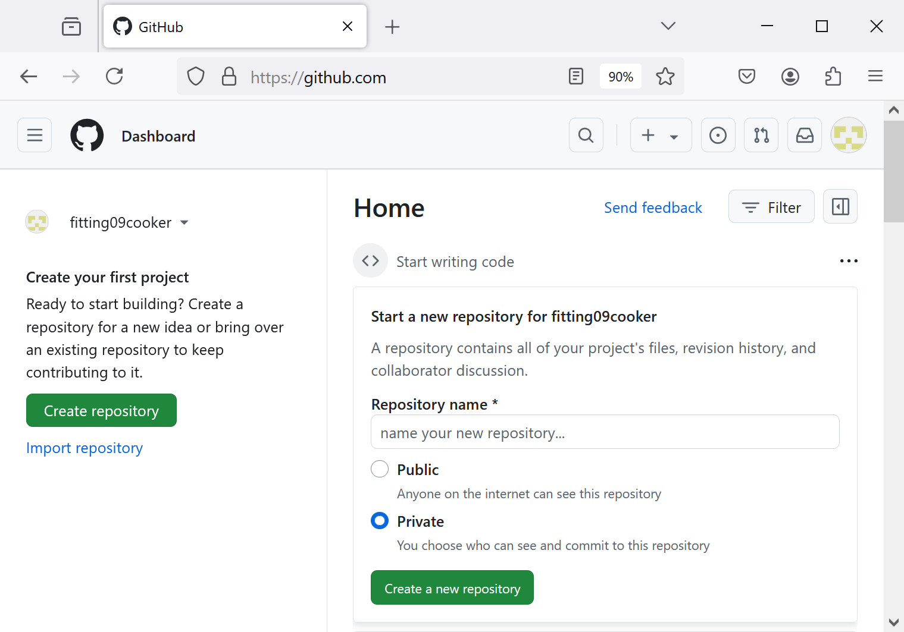

# Kodi GDrive Add-on

Hướng dẫn chứng thực Google Drive Stream Video trên Kodi App

## Các bước chuẩn bị

- Tài khoản Github [https://github.com/signup]
- Tài khoản Upstash [https://console.upstash.com/login]
- Tài khoản Vercel [https://vercel.com/]
- Tài khoản Google Drive

👋 **Chú ý:** DÙNG TÀI KHOẢN GITHUB ĐỂ ĐĂNG KÝ (SIGN-UP) CÁC TÀI KHOẢN UNSTASK VÀ VERCEL

## BƯỚC 1: Đăng ký tài khoản Github

- Nếu bạn chưa có tài khoản Github thì đăng ký tại địa chỉ [https://github.com/signup] các bước đăng ký gồm nhập email, mật khẩu, captcha. Đăng ký thành công bạn cần xác thực email một lần nữa. Coi như đã hoàn tất bước này

## BƯỚC 2: Đăng ký tài khoản Upstash

- Truy cập [https://console.upstash.com/login] chọn đăng ký tài khoản bằng tài khoản Github ở bước 1

## BƯỚC 3: Đăng ký tài khoản Vercel ( dùng để tạo trang web )

- Truy cập [https://vercel.com] chọn Sign-Up tài khoản Vercel bằng Github

## BƯỚC 3: Tạo Google Certificate API

- Truy cập [https://console.cloud.google.com] để tạo API
